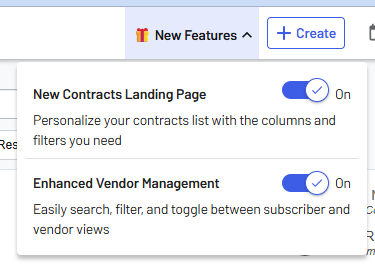

# 🎁 New Features Button - Concept Gallery

An interactive prototype exploring different enhancement concepts for the "New Features" button in OpenGov products.

---

## 📋 Overview

**What is this?**  
This is a **non-functional prototype** designed to explore and visualize different approaches to feature announcements and user adoption. It demonstrates how the existing "New Features" button could be enhanced to improve user engagement, education, and feature discovery.

**Purpose:**  
- Visualize 9 distinct enhancement concepts in an interactive gallery (plus a full experience combining all)
- Allow stakeholders to evaluate different strategies side-by-side
- Provide detailed behavioral descriptions for each concept
- Enable rapid iteration on design and UX patterns

**Important:** This prototype uses **fake data** and does not connect to any real systems. All interactions, metrics, and timers are simulated for demonstration purposes only.

---

## 📸 Current State: The Existing View

<div align="center">
  
  <p><em>The current "New Features" button with a basic dropdown list and toggle switches.</em></p>
</div>

**Current Functionality:**
- Simple dropdown with feature list
- Toggle switches to enable/disable features
- No badges, timers, or additional engagement mechanisms
- No links to documentation or roadmaps

**Challenge:** How can we make feature discovery more engaging, educational, and effective?

---

## 🚀 Getting Started

```bash
# Clone the repository
git clone https://github.com/moti-og/new-features-ads.git
cd new-features-ads

# Open in your browser (no build required!)
open index.html
```

That's it! The prototype runs entirely in your browser with no dependencies or setup needed.

### Explore the Gallery
1. View the grid of 9 enhancement concepts plus the full experience (#10)
2. Click each button to see its unique behavior
3. Read the detailed behavior descriptions on each card
4. Try the "Full Experience" (#10) to see all features combined

---

## 🗂️ Enhancement Concepts (Organized by Category)

### 🎉 Awareness & Excitement
Visual indicators and celebratory elements to draw attention and create positive engagement.

#### 1️⃣ Basic Badge Count
- Shows numerical count of new features (e.g., "3")
- Badge disappears when user opens dropdown
- Simple list view with toggle switches
- **Use Case:** Minimal, non-intrusive notification

#### 2️⃣ Multiple Badge Types
- **NEW:** Red/pulsing - first 14 days after release
- **HOT:** Pink/🔥 - high-value or trending features
- **Coming Soon:** Blue/⏰ - launching within 7 days
- Features can have multiple badges
- **Use Case:** Visual categorization and prioritization

#### 3️⃣ Celebration!
- Triggers confetti animation when features are enabled
- 3-second multi-burst celebration effect
- Toast notification with success message
- **Use Case:** Gamification and positive reinforcement

---

### 📅 Planning & Anticipation
Tools to help users understand what's coming and when.

#### 4️⃣ Feature Roadmap
- Links to external product roadmap
- Status indicators: ✓ Released, 🚀 In Progress, 📅 Upcoming
- Quarterly timeline view
- **Use Case:** Transparency and future-looking communication

#### 5️⃣ Countdown Timers
- Progress bars showing time until feature launch
- Format: "4d 23h 45m 12s" with release date
- Real-time updates every second
- Shows "🚀 Available Now!" at launch
- **Use Case:** Building anticipation for upcoming features

---

### 📚 Education
Resources to help users learn about and adopt features.

#### 6️⃣ Documentation Links
- **"📖 Learn More"** - Links to OpenGov support site
- **"🎮 Try Demo"** - Interactive loading modal + demo video
- Side-by-side button layout per feature
- External link indicators
- **Use Case:** Self-service learning and onboarding
- **Easter Egg:** Demo button shows loading screen then opens video

#### 7️⃣ Release Notes
- "📋 View Full Release Notes" link in dropdown header
- Opens dedicated release notes page in new tab
- Auto-generated from Jira/Aha
- Searchable and filterable by category
- **Use Case:** Detailed changelog for technical users

#### 8️⃣ Adoption Metrics
- Progress bars showing adoption percentage
- Formula: (Users w/ feature ON) / (Total active users)
- Real-time updates across organization
- **Use Case:** Social proof and FOMO (fear of missing out)

---

### 💬 Feedback
Channels for users to share ideas and requests.

#### 9️⃣ Suggestion Form
- "💬 Suggest a Feature" button in dropdown footer
- Modal with Title, Description, Priority fields
- Confetti + notification on submission
- Integration with Aha for automatic idea creation
- **Use Case:** User engagement and feedback collection

---

### 🌟 Full Experience

#### 🔟 All Features Combined
- Combines ALL 9 enhancements into one complete implementation
- Badge count + Release notes + Confetti + Timers + Badges + Metrics + Docs + Roadmap + Suggestions
- Spans full width of grid (featured placement)
- **Use Case:** Maximum engagement, full-featured experience

---


## 🔗 External Integrations

### Current Links
- **OpenGov Support:** `https://opengov.my.site.com/support/s/`
- **Product Roadmap:** `https://opengov-roadmap.vercel.app/roadmap`
- **Demo Video:** `https://www.youtube.com/watch?v=2qBlE2-WL60`

### Integration Ideas
- **Jira/Aha:** Auto-populate release notes
- **Analytics:** Track adoption rates, feature usage
- **Notification System:** Push alerts for new features